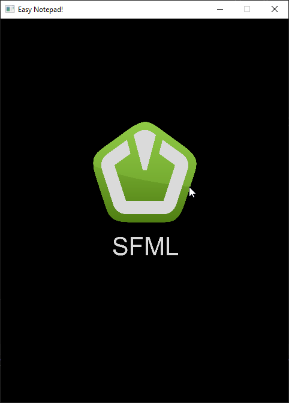
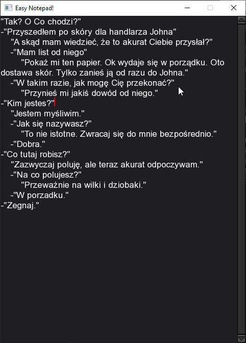

# Easy Notepad

## Spis treści
- [Opis](#opis)
- [Zrzuty ekranu](#zrzuty-ekranu)
- [Instalacja](#instalacja)
- [Technologie](#technologie)
- [Licencja](#licencja)

## Opis
**Easy Notepad** to prosty edytor tekstu obsługujący znaki szerokie (wchar_t), w tym białe znaki, takie jak spacje (L' ') i tabulatory (L'\t). Edytor automatycznie zawija tekst (wrapowanie linii) w zadanej szerokości okna. Edytor posiada również funkcję wklejania tekstu z użyciem skrótu Ctrl+V. Niestety obecnie edytor nie pozwala na zaznaczanie, kopiowanie oraz wycinanie tekstu.

## Zrzuty ekranu

## Instalacja
1. Pobierz i zainstaluje CMake
2. Pobierz bibliotekę SFML i umieść ją w katalogu `C:\SFML-2.6.2`.
3. Otwórz **Wiersz poleceń (cmd)**.
4. Przejdź do katalogu projektu:
`
cd ..\..\Easy Notepad
`
5. Utwórz folder **build**:
`
mkdir build
`
6. Wejdź do folderu **build**:
`
cd build
`
7. Uruchom konfigurację projektu za pomocą **CMake**:
`
cmake ..
`
8. Zbuduj projekt:
`
cmake --build .
`

9. Plik wykonywalny znajdziesz w **build/Debug** lub **build/Release**

## Technologie
Program stworzono w języku C++ z wykorzystaniem biblioteki SFML 2.6.2.  
  
## Licencja
Licencja Otwarta – Uznanie autorstwa  
  
Ten program może być:  
-Pobierany  
-Kopiowany  
-Modyfikowany  
-Wykorzystywany w projektach prywatnych i komercyjnych  
  
Pod warunkiem, że:  
-Zachowana zostanie informacja o autorze oryginalnego programu  
-Podane zostanie źródło (link do repozytorium)  
-W przypadku modyfikacji, należy wyraźnie zaznaczyć, że program został zmodyfikowany oraz przez kogo.  